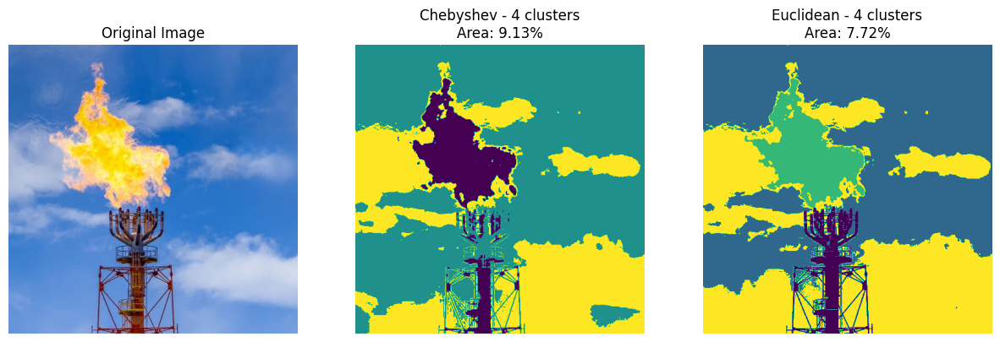
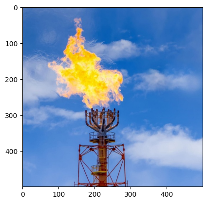
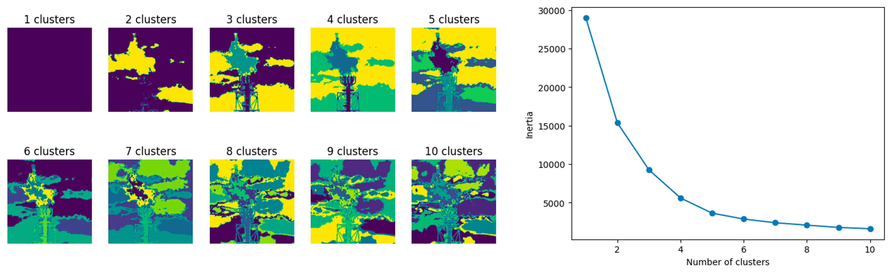
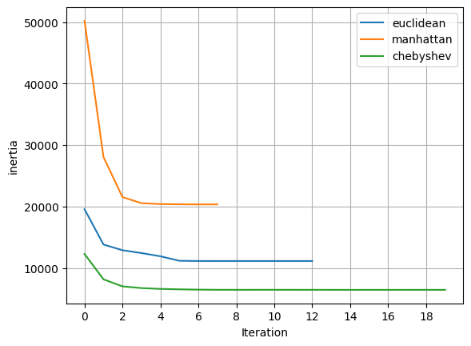
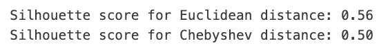

# Flare Image Clustering with KMeans
## Description



Welcome! this repository contains a notebook to showcase a simple workflow to
calculate the area (in percentage)of a flame at a flare stack by applying KMeans
clustering. The notebook will show an exercise to determine the optimum number
of cluster using `scikit-learn` `KMeans` class, and a custom KMeans
clustering model to enable user to select the distance method used to update the
new centroid within each training iterations.

## Software Installation Guide

1. As the repository is not a Python package, ensure that you already have an
environment with your desired Jupyter suite to open the notebook
2. The required packages are simple data science libraries. A requirement file
is provided should you want to ensure the installation.

```bash
pip install -r requirements.txt
```

## User Guideline
1. The notebook starts with module imports and image loading of
`flare_example.jpg` with `matplotlib` image class. The loaded image is then
cropped to square and converted to dataframe to ease further processing.



2. A custom transformer is then provided to normalize the RGB values in the
dataframe to 0-1 by dividing it with 255 (the largest pixel value possible).
This step can be beneficial to provide equal weighting of features (if one
channel has a much larger values than others, it might dominate the distance
calculation, leading to biased clustering), improved convergence, and
interpretability

3. The custom transformer is then combined in a pipeline with `KMeans`
to sensitize optimum number of cluster using elbow plot and domain judgement.



With the result above, it is safe to say that 4 clusters would be a sufficient
number to distinguish the flame at the flare stack

4. As we know, the way KMeans updates its clusters assignment is by firstly
calculating the distance between each point and the cluster center. This
distance itself is something to be sensitized on and can provide better result
if tuned from the default one in `KMeans` class. Since the implementation to
select other distance type is not provided, a custom KMeans class is provided
in the notebook that have this hyperparameter available to be tuned.

  a. Euclidean Distance: Often referred as the "ordinary" distance, it is the
  length of the straight line between two points in Euclidean space.
  $$d = \sqrt{(X - X_c)^2 + (Y-Y_c)^2}$$

  b. Manhatttan Distance: Known as the "taxicab" or "city block" distance. It's
  the sum of the absolute differences of their Cartesian coordinates.
  $$d = |X-X_c| + |Y-Y_c|$$

  c. Chebyshev Distance: A metric defined on a vector space where the distance
  between two vectors is the greatest of their differences along any coordinate
  dimension.
  $$d = \max(|X-X_c|,|Y-Y_c|)$$



If we plot the inertia (within-cluster sum of squares) that measures the
compactness of each cluster of each distances. We would know that Euclidean and
Chebyshev distance is better compared to Manhattan in this case. But seeing from
a metric is not enough to tell the most suitable solution.




The image above shows the Silhouette score (representation of how well each
object lies within its cluster. It lies from -1 to 1, where a high value
indicates that the object is well matched to its own cluster and poorly matched
to neighboring clusters). From the Silhouette score, it is known that the
performance between Chebyshev and Euclidean are similarly good, but from the
plots, we would know that the Chebyshev distance might have some over-estimation
as some parts of the flare rig are considered as the same cluster as the flame.

## Future Improvements
